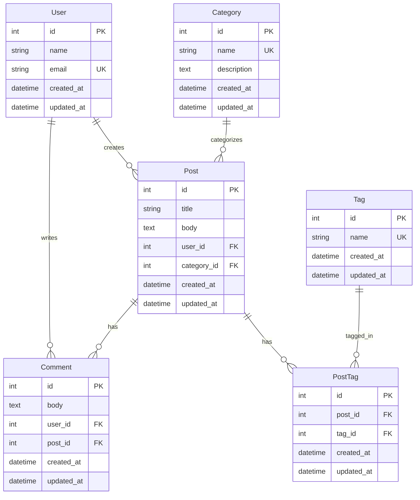
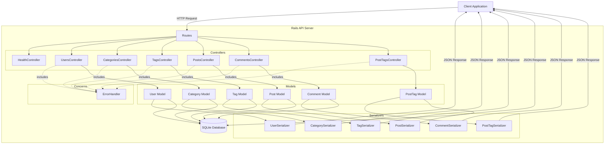
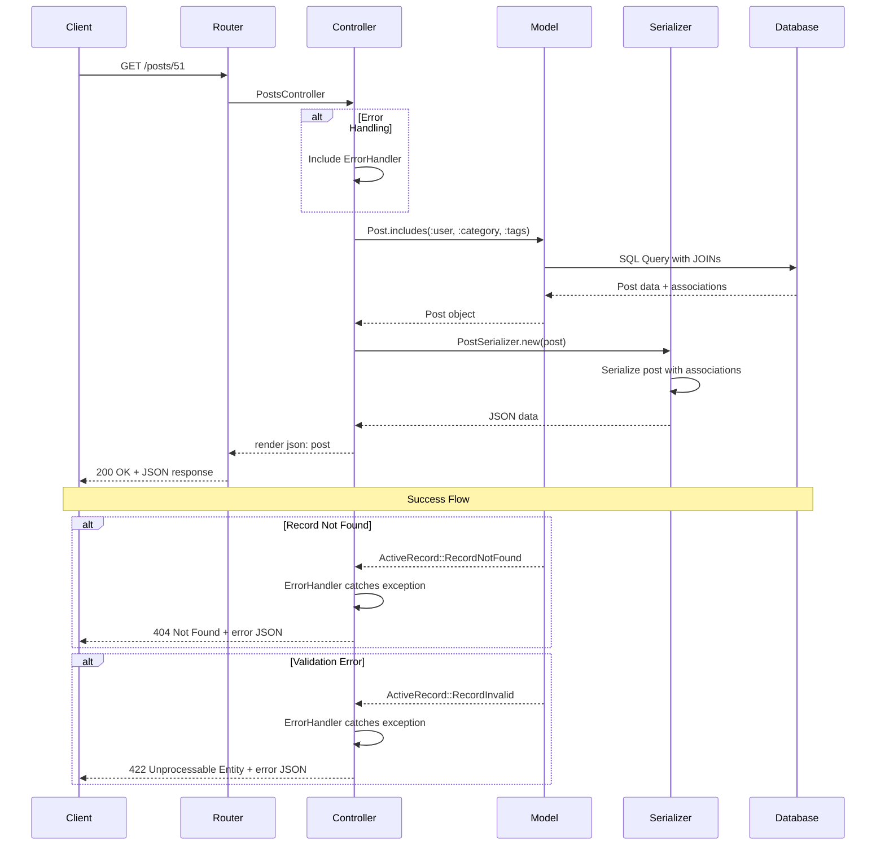
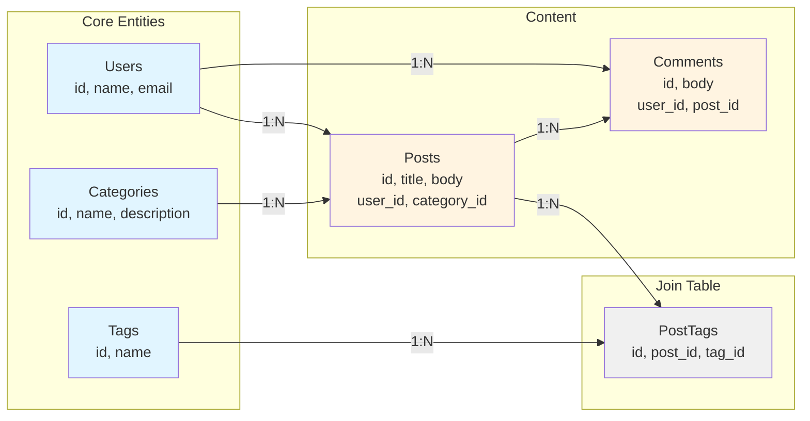
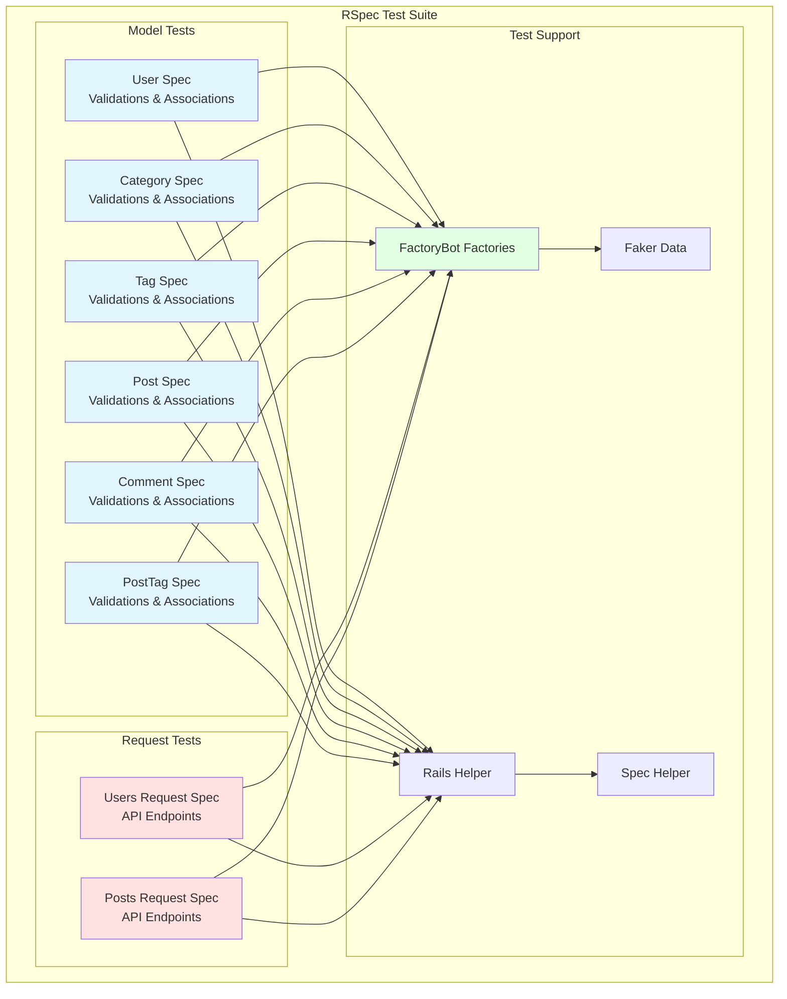
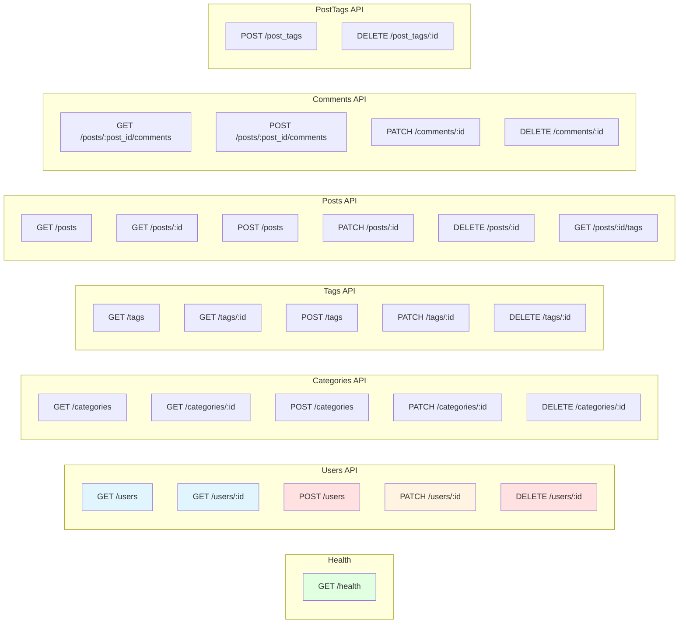
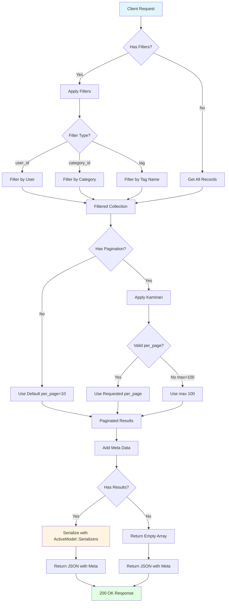
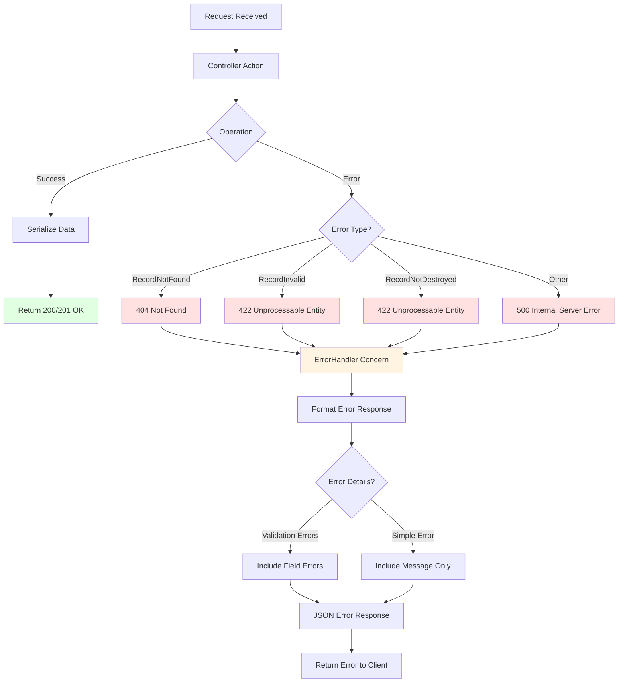
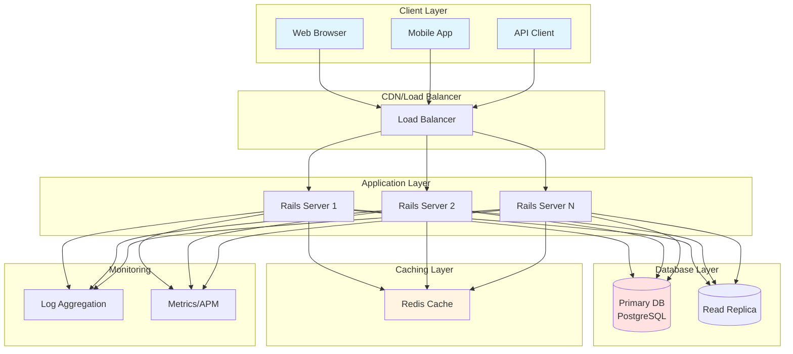

# Project Diagrams

This document contains Mermaid diagrams visualizing the Rails API project architecture.

## Table of Contents

1. [Entity Relationship Diagram (ERD)](#entity-relationship-diagram-erd)
2. [API Architecture](#api-architecture)
3. [Request Flow](#request-flow)
4. [Database Schema](#database-schema)
5. [Controller Structure](#controller-structure)
6. [Test Structure](#test-structure)

---

## Entity Relationship Diagram (ERD)

---

## API Architecture

---

## Request Flow

---

## Database Schema

---

## Controller Structure

```mermaid
graph TD
    AC[ApplicationController]
    EH[ErrorHandler Concern]
    
    AC --> HC[HealthController]
    AC --> UC[UsersController]
    AC --> CC[CategoriesController]
    AC --> TC[TagsController]
    AC --> PC[PostsController]
    AC --> CMC[CommentsController]
    AC --> PTC[PostTagsController]
    
    EH -.included in.-> UC
    EH -.included in.-> CC
    EH -.included in.-> TC
    EH -.included in.-> PC
    EH -.included in.-> CMC
    EH -.included in.-> PTC
    
    UC -->|index| UCA[List Users + Pagination]
    UC -->|show| UCB[Get User by ID]
    UC -->|create| UCC[Create User]
    UC -->|update| UCD[Update User]
    UC -->|destroy| UCE[Delete User]
    
    PC -->|index| PCA[List Posts + Pagination]
    PC -->|show| PCB[Get Post with Associations]
    PC -->|create| PCC[Create Post]
    PC -->|update| PCD[Update Post]
    PC -->|destroy| PCE[Delete Post]
    PC -->|tags| PCF[Get Post Tags]
    
    CMC -->|index| CMA[List Comments for Post]
    CMC -->|create| CMB[Create Comment]
    CMC -->|update| CMC1[Update Comment]
    CMC -->|destroy| CMD[Delete Comment]
    
    style AC fill:#e1f5ff
    style EH fill:#ffe1e1
    style HC fill:#e1ffe1
```

---

## Test Structure

---

## API Endpoints Flow

---

## Pagination & Filtering Flow

---

## Error Handling Flow

---

## Deployment Architecture (Recommended)

---

## How to View These Diagrams

### Option 1: GitHub (Automatic Rendering)
When you push this file to GitHub, all Mermaid diagrams will be automatically rendered.

### Option 2: VS Code
Install the "Markdown Preview Mermaid Support" extension to view diagrams in VS Code.

### Option 3: Online Viewer
Copy any diagram code and paste it into:
- https://mermaid.live/
- https://mermaid.ink/

### Option 4: Documentation Sites
Use with documentation generators like:
- MkDocs with mermaid2 plugin
- Docusaurus
- GitBook

---

**Last Updated:** 2025-10-21  
**Diagrams:** 10  
**Format:** Mermaid

